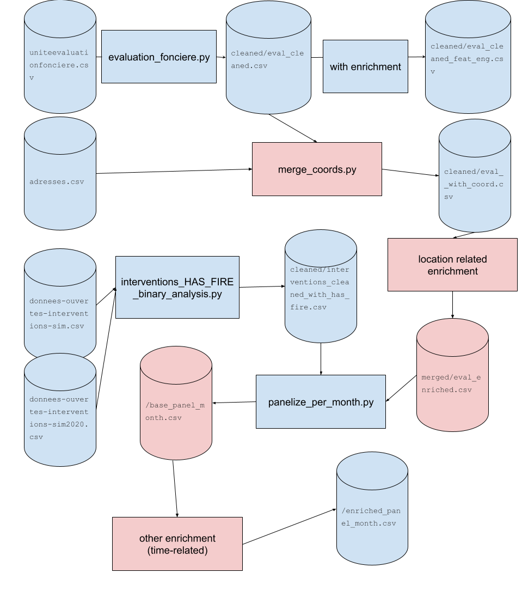

# all-capstone-project-summer-2025-team-6
## Table of Contents

- [Data Pipeline Diagram](#data-pipeline-diagram)
- [How to Run the Data Pipeline](#how-to-run-the-data-pipeline)
- [Testing Temporal Fire Risk Modeling](#testing-temporal-fire-risk-modeling)
  - [Data Cleaning and Merging Pipeline](#data-cleaning-and-merging-pipeline)
    - [Description: evaluation_fonciere.py](#description-evaluation_foncierepy)
## [Data pipeline diagram](https://docs.google.com/drawings/d/1JSGUZZg9EYoyRtfRQbYmxvmRRgAAAtKCh4ktoKaSbEA/edit)


### How to run the data pipeline:

You need to run these 3 files:

```commandline
python ./dataprep/evaluation_fonciere.py
python ./dataprep/interventions_HAS_FIRE_binary_analysis.py
python ./dataprep/main_evaluation_fonciere.py
```
You must run the `python ./dataprep/main_evaluation_fonciere.py` to get the file *evaluation_with_fire_and_coordinates_and_date.csv*
I did not commit it because it's 100MB big.

Note: alternatively, this command runs the whole pipeline
```commandline
python ./datapipeline_no_panel.py
```

# Panel data approach
This approach avoids issue with fire_date being null in the merged dataset when there is no fire. 
Each row is represented once per month to keep some homogeneity 
| ID_UEV        | Feature X      | MONTH | HAS_FIRE_IN_MONTH |
| ------------- | -------------- | ----- | ----------------- |
| 1234          | Value for 1234 |   1   |             False |
| 1234          | Value for 1234 |   2   |              True |
| 1234          | Value for 1234 |   ... |         ...       |
| 1234          | Value for 1234 |  12   |             False | 
| 4321          | Value for 4321 |   1   |             False |
| 4321          | Value for 4321 |  ...  |             False |
| 4321          | Value for 4321 |   12  |              True |

The HAS_FIRE_IN_MONTH column is True if there has been a fire within a 100m radius of this address in the specific MONTH.


## [Data pipeline diagram - Panel](https://docs.google.com/drawings/d/1LDBP_V14_hb_kPNOQbJvcjOaFdfQV9Tg8OQIGbXWYMY/edit?usp=sharing)

Note: items in red are yet to be completed

### [Running the panel data pipeline]
```commandline
python ./datapipeline_panel_month.py
```


Option 2: (To be unified in second stage with the pipeline discussed above)
I will write the details about input and output

```commandline
python ./dataprep/evaluation_fonciere.py                   ====>eval_cleaned_feat_eng.csv
python ./dataprep/interventions_HAS_FIRE_binary_analysis.py ====> interventions_cleaned_with_has_fire.csv
python ./dataprep/main_evaluation_feat_eng.py              ====> eval_fire_Coordinates_date_feat_eng_2.csv


python ./dataprep/dense_panel_building_month.py         ====> 

for time model run in dataprep:  time_model_Xgboost.ipynb   (When we run the same .py file we are having a memory error)
```


