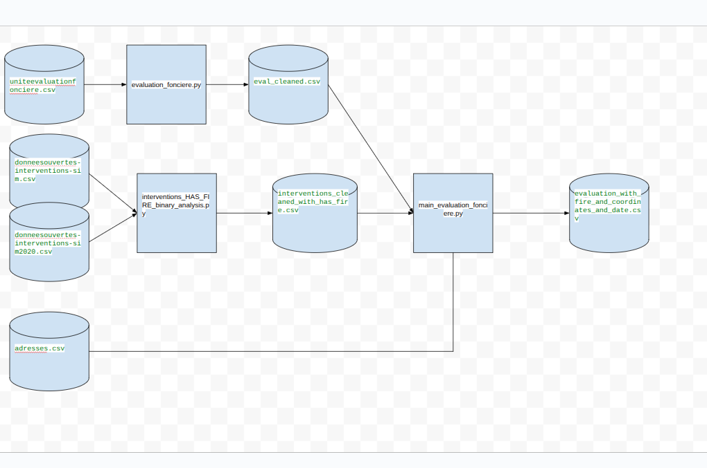

# all-capstone-project-summer-2025-team-6

## [Data pipeline diagram](https://docs.google.com/drawings/d/1JSGUZZg9EYoyRtfRQbYmxvmRRgAAAtKCh4ktoKaSbEA/edit)


### How to run the data pipeline:

You need to run these 3 files:

```commandline
python ./dataprep/evaluation_fonciere.py   ===> eval_cleaned.csv
python ./dataprep/interventions_HAS_FIRE_binary_analysis.py===> interventions_cleaned_with_has_fire.csv
python ./dataprep/main_evaluation_fonciere.py ===> evaluation_with_fire_and_coordinates_and_date.csv
```
You must run the `python ./dataprep/main_evaluation_fonciere.py` to get the file `evaluation_with_fire_and_coordinates_and_date.csv`
I did not commit it because it's 100MB big.

# Models
We evaluated multiple models. This subsection describes how to run them and summarizes their performance
## Testing temporal fire risk modeling
`datamodel/` contains a Python script for testing temporal fire risk modeling.  
Please note that this is an early test — the results are not yet precise.  
To improve the model, additional feature engineering is required.

The script `Monthly_fire_Risk_prediction-test.py` runs a monthly fire risk prediction test.  
You can execute it from the project root with:
### Data Cleaning and Merging Pipeline

```bash
python ./datamodel/Monthly_fire_risk_prediction-test.py

1. dataprep/evaluation_fonciere.py:  We use the dataset uniteevaluationfonciere.csv from the website https://donnees.montreal.ca/dataset/unites-evaluation-fonciere 

We clean in evaluation_fonciere.py and we output the dataset eval_cleaned.csv in datasets/cleaned.

2. datamerge/merge_evaluationfonciere_adresses.py : We merge eval_cleaned.csv and adresses.csv and we do some feature engineering in datamerge/merge_evaluationfonciere_adresses.py we output the file merged_evaluationfonciere_adresses.csv  in datasets/merged

 

3. dataprep/interventions_HAS_FIRE_binary_analysis.py:        We use the datasets:

donneesouvertes-interventions-sim.csv and donneesouvertes-interventions-sim2020.csv saved in datasets/raw from the website https://donnees.montreal.ca/en/dataset/interventions-service-securite-incendie-montreal    we isolated records labeled as fire-related specific  in DESCRIPTION_GROUPE using categories AUTREFEU, INCENDIE   we output datasets/cleaned/interventions_cleaned_with_has_fire.csv

4.datamerge/merged_interventions_evaluationfonciere_adresses.py  : merge  datasets/cleaned/interventions_cleaned_with_has_fire.csv  with datasets/merged/merged_evaluationfonciere_adresses.csv    The output is merged_interventions_evaluationfonciere_adresses_binary_analysis_1.csv  which has some feature engineering but we can add more for sure


Remark: I have some mistakes to be fixed in the read_csv if you are using visual studio since i was working in jupyternotebook all the time. Check all this if you want to use the github same enviroment folder only to located the files
