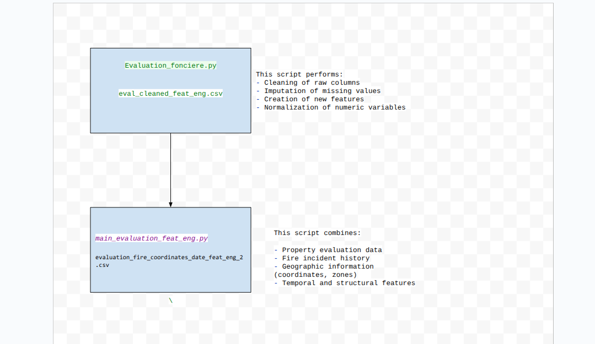

# Report

## Table of Contents

1. [Purpose](#purpose)
2. [Two main approaches](#two-main-approaches)
3. [Data Cleaning and Merging Pipeline](#data-cleaning-and-merging-pipeline)
4. [Model Evaluation Criteria](#3-model-evaluation-criteria)
5. [Models Tried](#4-models-tried)
   - [RandomForestClassifier](#randomforestclassifier)
     - [Target Variable](#target-variable)
     - [Confusion Matrix](#confusion-matrix)
     - [Classification Report](#classification-report)
   - [LGBMClassifier](#lgbmclassifier)
     - [Target Variable](#target-variable-1)
     - [Model Results (All Months)](#model-results-all-months)
     - [Model Results (Months 1–12 only)](#model-results-months-1–12-only)
   - [Monthly Fire Risk Prediction Using XGBoost](#Monthly-Fire-Risk-Prediction-Using-XGBoost)
     - [Script Location](#script-location)
     - [Data Pipeline](#data-pipeline)
     - [Feature Engineering](#feature-engineering)
     - [Model](#model-xgboostclassifier)
     - [Evaluation](#evaluation-default-threshold--05)
     - [Threshold Optimization](#threshold-optimization)
     - [Final Model Evaluation](#final-model-evaluation--threshold--055)
     - [Recommendations](#recommendations)
     - [Binary vs Probabilistic Forecasting](#binary-vs-probabilistic-forecasting)
     - [Summary](#summary)


## Purpose

Project A – Predicting High Fire Risk Areas in Montreal

Objective: The objective of this project is to predict high fire risk areas by month in the city of Montreal, based on historical firefighter intervention data and additional open datasets.

## Two main approaches

### "Panel" Approach
Structure:
Each building has one row per month (e.g., Jan 2018, Feb 2018, ..., Dec 2022).

```
ID_UEV | YEAR | MONTH | Features... | fire_occurred
-----------------------------------------------------
001    | 2020 |   1   | ...         | 0
001    | 2020 |   2   | ...         | 0
001    | 2020 |   3   | ...         | 1
...
fire_occurred = 1 for the month of fire; 0 otherwise.
```

No fire_month column needed — you're modeling fire per building-month.

Good for temporal modeling, like survival analysis or monthly fire risk.

### Fire Month or 13 Per-Building Row Approach
Structure:
One row per building; fire_month = 1–12 if fire occurred, else 13.


```
ID_UEV | Features... | fire_month
----------------------------------
001    | ...         | 3
002    | ...         | 13
003    | ...         | 7
...
```
Simple classification task: which month is the fire, or no fire (13).

Only one row per building — no temporal unfolding.

fire_month = 13 explicitly encodes “no fire”.


## Data Cleaning and Merging Pipeline


## Model evaluation criteria
- Priority is given to recall over precision as we'd rather capture more fire risk including a few false negatives than miss high risk buildings
- Train set/Test set : we used a temporal split rather than random split
Train = data before 2024
Test = data of 2024-2025

This is especially important because of the approximation of fire location due to data obfuscation to avoid leaking knowledge of fires into the train set.

## Models tried

### RandomForestClassifier
(Located in file [EDA-incident-evaluation-fonciere.ipynb](EDA-incident-evaluation-fonciere.ipynb), for pipeline see [instructions](README.md/#how-to-run-the-data-pipeline))

**Target Variable**

Y = P(Fire | X)

Where X includes:

- `log_terrain`
- `log_batiment`
- `log_etage_hors_sol`
- `log_numbre_de_logement`
- `ANNEE_CONSTRUCTION`
- `density`


**Confusion Matrix**

|               | Predicted False | Predicted True |
|---------------|------------------|----------------|
| **Actual False** | 64,073           | 9,540          |
| **Actual True**  | 8,273            | 50,871         |


**Classification Report**

| Label        | Precision | Recall | F1-score | Support |
|--------------|-----------|--------|----------|---------|
| **False**    | 0.89      | 0.87   | 0.88     | 73,613  |
| **True**     | 0.84      | 0.86   | 0.85     | 59,144  |
|              |           |        |          |         |
| **Accuracy** |           |        | 0.87     | 132,757 |
| **Macro avg**| 0.86      | 0.87   | 0.86     | 132,757 |
| **Weighted avg** | 0.87  | 0.87   | 0.87     | 132,757 |


ROC AUC: 0.936

### LGBMClassifier
(Located in file [Model-building.ipynb](Model-building.ipynb), for pipeline see [instructions](README.md/#how-to-run-the-data-pipeline))

**Target Variable**

Y = P(Month of Fire | X)

Where X includes:

- `ETAGE_HORS_SOL`
- `NOMBRE_LOGEMENT`
- `ANNEE_CONSTRUCTION`
- `SUPERFICIE_TERRAIN`
- `SUPERFICIE_BATIMENT`
- `LONGITUDE`
- `LATITUDE`

**Note**: Properties with no recorded fire were assigned to month 13 to indicate the absence of fire incidents

| Metric         | Precision | Recall | F1-score | Support |
|----------------|-----------|--------|----------|---------|
| **Accuracy**   |           |        | 0.676    | 132,757 |
| **Macro avg**  | 0.457     | 0.348  | 0.388    | 132,757 |
| **Weighted avg** | 0.629   | 0.676  | 0.640    | 132,757 |


I then tried to train only on months 1-12:

| Metric           | Precision | Recall | F1-score | Support |
|------------------|-----------|--------|----------|---------|
| **Accuracy**     |           |        | 0.434    | 58,954  |
| **Macro avg**    | 0.439     | 0.433  | 0.434    | 58,954  |
| **Weighted avg** | 0.437     | 0.434  | 0.433    | 58,954  |


# Monthly Fire Risk Prediction Using XGBoost

## Script Location
`/dataprep/time_model_Xgboost.ipynb`

This script trains and evaluates a binary classifier to predict whether a fire will occur in a specific building in a given month. It utilizes a **dense panel dataset** with rich building-level and temporal-spatial features.

---

## Data Pipeline
- **Input file:** `building_month_fire_panel_feat_eng.csv`
- **Granularity:** Monthly panel of all buildings
- **Target Variable:** `HAS_FIRE_THIS_MONTH` (0 or 1)

---

## Feature Engineering

### Structural & Geographic Features:
- `MUNICIPALITE`, `ETAGE_HORS_SOL`, `NOMBRE_LOGEMENT`, `AGE_BATIMENT`
- `SUPERFICIE_TERRAIN`, `SUPERFICIE_BATIMENT`, `RATIO_SURFACE`, `DENSITE_LOGEMENT`
- `HAS_MULTIPLE_LOGEMENTS`, `CODE_UTILISATION`, `CATEGORIE_UEF`
- `NO_ARROND_ILE_CUM`, `BUILDING_COUNT`

### Zone-Level Fire Risk:
- `FIRE_FREQUENCY_ZONE`, `FIRE_RATE_ZONE`, `FIRE_COUNT_LAST_YEAR_ZONE`
- `FIRE_RATE_ZONE_NORM`, `FIRE_COUNT_LAST_YEAR_ZONE_NORM`

### Temporal Lag Features:
- `fire_last_1m`, `fire_last_2m`, `fire_last_3m`
- `fire_cumcount`, `fire_rolling_3m`, `fire_rolling_6m`, `fire_rolling_12m`
- `month_num`, `year`

---

## Model: XGBoostClassifier
- Handles class imbalance with `scale_pos_weight`
- Supports categorical variables with `enable_categorical=True`
- Optimized with:
  - `n_estimators=200`, `max_depth=6`, `learning_rate=0.1`
  - `subsample=0.8`, `colsample_bytree=0.8`

---

## Evaluation (Default Threshold = 0.5)
| Class | Precision | Recall | F1-score | Support |
|-------|-----------|--------|----------|---------|
| No Fire (0) | 0.9903 | 0.7436 | 0.8494 | 3,674,405 |
| Fire (1)    | 0.0243 | 0.4665 | 0.0461 | 50,239    |

- **Accuracy**: 73.99%
- **Macro F1**: 0.4477
- **Weighted F1**: 0.8379

> ❌ *Precision for fires is very low, but recall is moderate. Useful for prioritization, not alarms.*

---

## Threshold Optimization
Evaluated thresholds: `0.2` → `0.55`
- Best **F2 Score** (recall-focused): **0.55**

| Threshold | Precision | Recall | F2 Score |
|-----------|-----------|--------|----------|
| 0.50      | 0.027     | 0.603  | 0.113    |
| 0.55      | 0.0262    | 0.378  | **0.103**|

---

## Final Model Evaluation @ Threshold = 0.55
| Class | Precision | Recall | F1-score | Support |
|-------|-----------|--------|----------|---------|
| No Fire | 0.9896 | 0.8081 | 0.8897 | 3,674,405 |
| Fire    | 0.0262 | 0.3780 | 0.0490 | 50,239    |

- **Confusion Matrix**:
  - True Negatives: ~2.97M
  - False Positives: ~700k
  - False Negatives: ~31k
  - True Positives: ~19k

> 📊 *High false positives but acceptable for early warning.*

---

## Recommendations
-  **Use threshold = 0.50–0.55** depending on recall vs precision preference
-  **Precision is low**, so interpret predictions as risk levels
-  **Use predicted probabilities** for prioritizing inspections
-  Add weather, crime, or inspection features for improved separation

---

## Binary vs Probabilistic Forecasting
| Aspect                         | `model.predict()` (Binary)              | `model.predict_proba()` + Threshold |
|--------------------------------|-----------------------------------------|-----------------------------------|
| Nature                         | Hard decision (0 or 1)                  | Probabilistic risk score (0.0–1.0) |
| Control over recall/precision  |  Fixed at 0.5                           | Fully tunable                     |
| Risk prioritization            | Not possible                            | Buildings can be ranked           |
| Early warning usability        |  Rigid                                  | Flexible, interpretable           |
| Best suited metric             | Accuracy, F1                            | F2 Score, Precision@K, Recall     |

> **Recommendation:** Use predicted probabilities to forecast fire risk, prioritize inspections, and adapt to seasonal or strategic needs.

---

## Next Steps
- Deploy as a **ranking tool** not a strict classifier
- Create dashboards that visualize monthly fire risk scores by building
- Use **precision@K** and **F2-score** as main evaluation metrics

---

## Summary
XGBoost + panel-level fire features + lag history yields a decent early-warning fire detection model. Prioritize **recall and interpretability**, refine with more context over time.
"""
